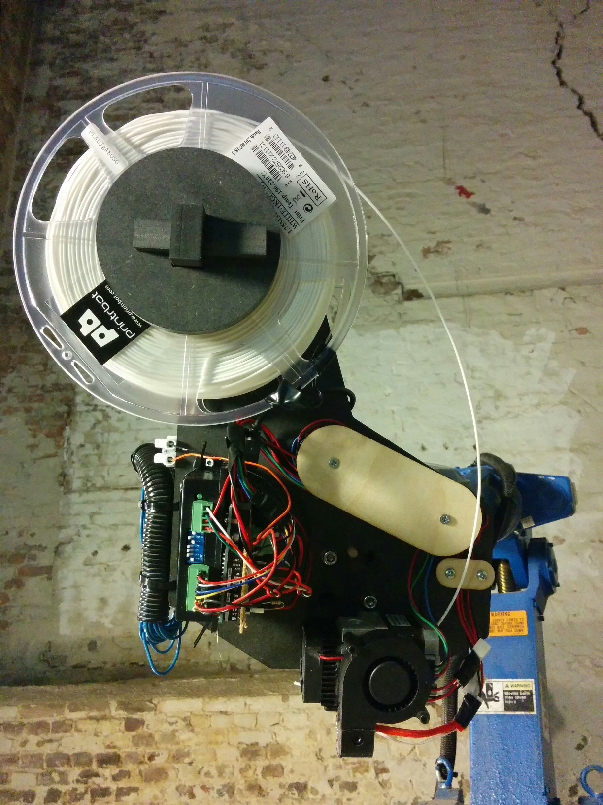
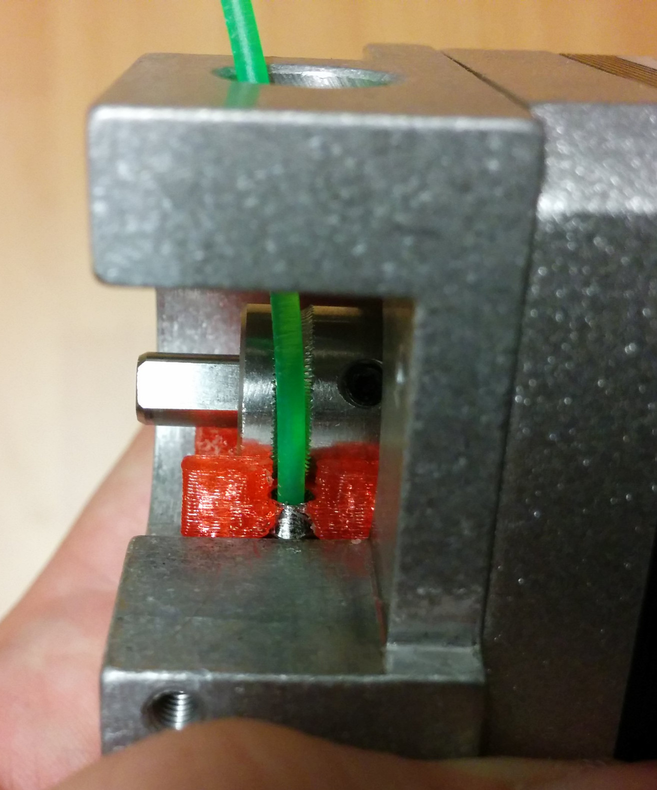
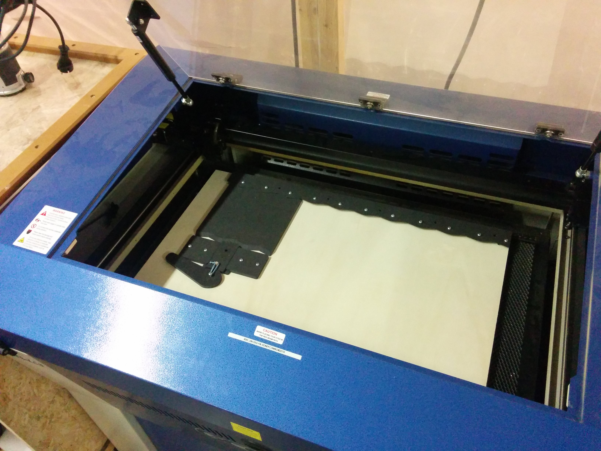
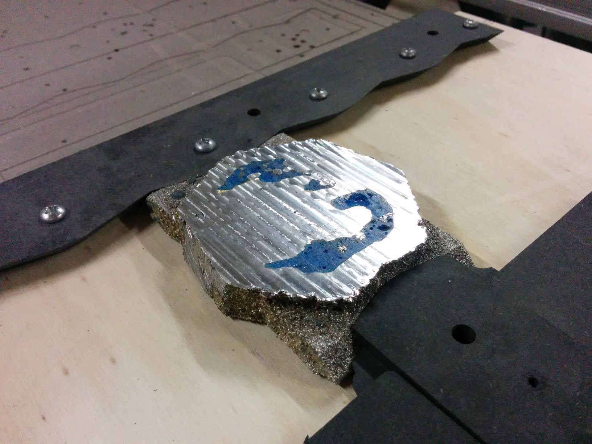
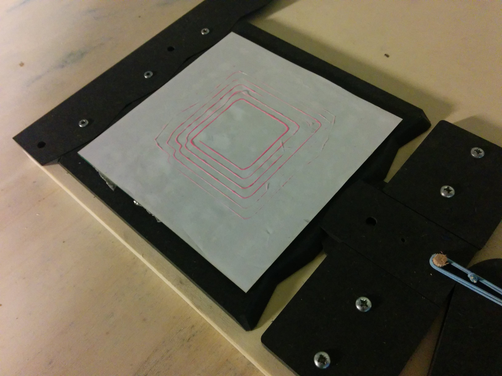

# Hackathon under Oslo Innovation Week 2015

Two-day hackathon during [Oslo Innovation Week](http://oiw.no), October 10-11 2015.
Participants from [Fellesverkstedet](http://fellesverkstedet) fablab, [Bitraf](http://bitraf.no) makerspace, and open drop-ins during event.

## 3d-print attachment for Motoman SK6 robot

* Using [yasnac Python tools](https://github.com/fellesverkstedet/yasnac) for controlling robot
* Using Arduino Uno with custom [Teacup-based firmware](https://github.com/fellesverkstedet/Teacup_Firmware)
* QB Extruder

### Extruder mods

## Universal quickmount for workpiece registration

* Movable 'palette', where the workpiece can move between different machines.
* With know registration for mount in machine, only need to consider workpiece offset relative to mount
* Easily adaptable to machines of different sizes
* Also possible to cast, or 3d-print the required structure directly into workpiece
* Other examples of machines interesting to use in workflow:
FDM 3d-printer (RepRap etc), silk-screen
* Tested with Shopbot CNC router, GCC laser-cutter and Motoman SK6 robot-arm.
And directly casting the geometry required on workpiece.

# Further work

TODO: document
